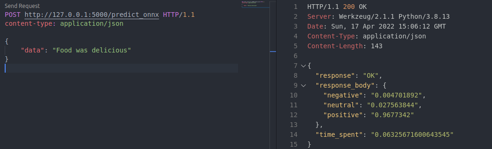
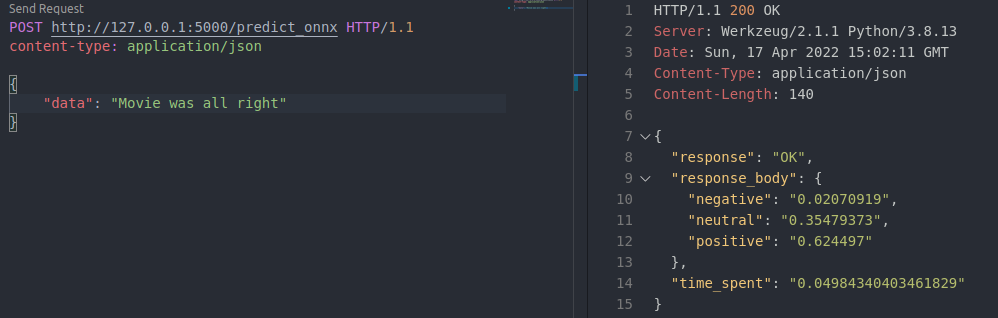

Сравнение инференса torch модели с использованием разных рантаймов:

- pytorch
- onnx

Результаты сравнения доступны в ноутбуке `ONNX vs. Vanilla Torch Comparison.ipynb`

Для сравнения и деплоя используется Rest API приложение на flask.

Примеры работы приложения:

